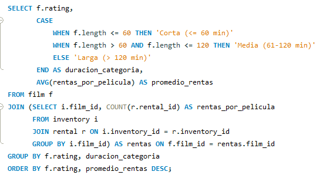
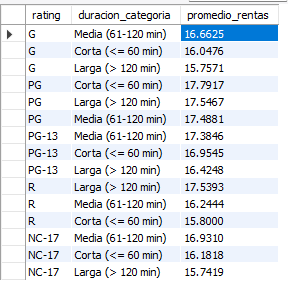
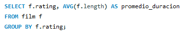
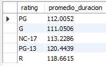
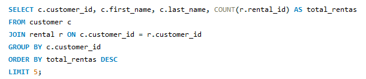
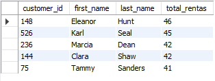
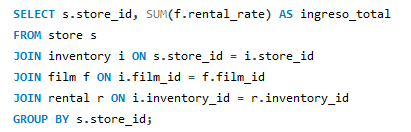
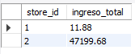
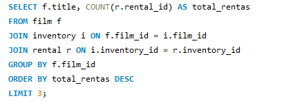
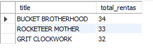

# Informe de Presentación de Resultados: ETL Films

## Arquitectura de Datos y Arquetipo de la Aplicación

La aplicación se diseñó para realizar un proceso ETL, el cual consiste en extraer, transformar, limpiar y cargar una base de datos de películas desde un archivo Excel a una base de datos MySQL. La arquitectura modular que quise proponer para esta prueba se compone de los siguientes módulos principales::

* **Extracción (`extraccion_datos.py`):** Este módulo se encarga de leer los datos desde el archivo Excel, utilizando la biblioteca Pandas. Los datos se extraen en forma de DataFrames, donde cada hoja del Excel se convierte en un DataFrame independiente, retornando de este modo un diccionario de DataFrames con el cual se trabajará en los siguientes modulos.
* **Transformación (`transformacion_datos.py`):** Este módulo realiza la limpieza y transformación de los datos extraídos, se procesa cada DataFrame de forma independiente, validando los valores de sus columnas y aplicando las siguientes transformaciones::
    * Conversión de nombres de columnas a minúsculas y eliminación de espacios en blanco al inicio.
    * Eliminación de filas duplicadas.
    * Manejo de valores nulos.
    * Eliminación de espacios en blanco innecesarios en valores de tipo cadena.
    * Conversión de columnas numéricas al tipo de dato correcto.
    * Formateo de nombres propios.

* **Carga (`carga_datos.py`):** Este módulo se encarga de cargar los datos transformados en una base de datos MySQL. Se utiliza la biblioteca `mysql-connector` para establecer la conexión y ejecutar las consultas de inserción.
* **Configuración de la Base de Datos (`configuracion_bd.py`):** Este módulo centraliza la configuración de la conexión a la base de datos MySQL.
* **Orquestador (`orquestador.py`):** Este módulo se coordina la ejecución de los módulos de extracción, transformación y carga, definiendo el flujo del proceso ETL.
* **Módulo Principal (`main.py`):** Este módulo inicia la ejecución del proceso ETL llamando al orquestador.

* **Log de seguimiento (`etl_films.log`):** Se implementó la librería logging en la aplicación para registrar en un archivo plano eventos clave durante la ejecución del proceso ETL, facilitando la depuración y el monitoreo. Este archivo se guarda dentro de la carpeta Logs y puede ser muy util para identificar problemas, rastrear el comportamiento de la aplicación y asegurar su correcto funcionamiento.

El arquetipo de la aplicación sigue un patrón de diseño modular, donde cada módulo tiene una responsabilidad específica. Lo cual segun los principios SOLID facilita el mantenimiento y la escalabilidad de la aplicación.

EL paradigma principal utilizado para la elaboración de la prueba fue programación estructurada; lo escogí para este proyecto debido a su claridad y facilidad para seguir el flujo del ETL, lo cual, si se piensa a futuro, hace mucho más fácil la comprensión, mantenimiento y escalabilidad de la aplicación. No obstante, se empleó programación orientada a objetos a través de las bibliotecas Pandas, mysql.connector, logging y os, que inherentemente utilizan objetos y métodos.

NOTA: Durante el proceso de configuración de Spark, surgieron dificultades técnicas relacionadas con incompatibilidades entre la versión de Python, el JDK y la propia configuración de Spark en mi máquina. A pesar de haber dedicado mucho tiempo a buscar soluciones, las restricciones de tiempo y la necesidad de preservar la estabilidad de otros proyectos personales en los que estoy trabajando me impidieron llevar a cabo los cambios necesarios para una implementación exitosa de Spark. En consecuencia, se decidió proceder con la prueba utilizando DataFrames nativos de la biblioteca Pandas y poder entregar a tiempo la prueba sin perder la funcionalidad esperada.

## Análisis Exploratorio de Datos

El análisis exploratorio de datos se realizó durante la fase de transformación. Se identificaron y corrigieron los siguientes problemas en los datos:

* **Valores nulos:** Se manejaron los valores nulos reemplazándolos por `None` para que python los pudiera procesar correctamente y que no generara error al momento de la inserción en MySQL
* **Duplicados:** Se eliminaron las filas duplicadas en cada una de las tablas para garantizar la integridad de los datos.
* **Inconsistencias en los tipos de datos:** Se convirtieron las columnas numéricas al tipo de dato correcto (entero o decimal) y se eliminaron caracteres no numéricos.
* **Inconsistencias en el formato de cadenas:** Se eliminaron espacios en blanco innecesarios y se formatearon los nombres propios.
* **Inconsistencia en la cantidad de columnas de las tablas fild y customer:** Mientras se exploraba los datos, detecte que tanto en la tabla fild como en la tabla customer habian columnas adicionales que no estaban planteadas en el MER facilitado, por lo cual como no sabia si se podia modificar el MER, decidi eliminarlas para garantizar que se cumpliera el diagrama y la disposición de datos planteada para el ejercicio, las columnas eliminadas fueron `num_voted_users` de la tabla film y `customer_id_old` y `segment` de la tabla customer.

## Preguntas de Negocio y Respuestas

1.  **¿¿Cuál es la relación entre la duración de las películas, su clasificación (rating) y el número de rentas, y cómo podemos utilizar esta información para optimizar nuestro inventario y estrategias de marketing??**
    * Conocer esta realación puede permitir identificar qué combinaciones de duración y clasificación son más populares entre los clientes, lo que ayuda a decidir qué películas adquirir y mantener en el inventario, adicional mejora la toma de decisiones estratégicas sobre la adquisición de películas, la fijación de precios y la planificación de campañas de marketing.
    * Query: 
    * Resultado: 

2.  **¿Cuál es el promedio de duración de las películas por clasificación (rating)?**
    * Conocer la duración promedio de las películas por clasificación puede ayudar a planificar el inventario y las recomendaciones de las películas.
    * Query: 
    * Resultado: 

3.  **¿Cuáles son los 5 clientes que más películas han rentado y cuántas rentas ha          realizado cada uno?**
    * Identificar a los clientes más frecuentes es crucial para programas de fidelización y estrategias de marketing dirigidas.
    * Query: 
    * Resultado: 

4.  **¿Cuál es el ingreso total generado por cada tienda?**
    * Evaluar el rendimiento de cada tienda es esencial para la gestión empresarial y la toma de decisiones comerciales.
    * Query: 
    * Resultado: 

5.  **¿Cuál es el top 3 de las películas más rentadas de todo el catálogo??**
    * Conocer cuales son las peliculas mas rentadas de toda la empresa pueda ayudar a encontrar tendencias en los gustos de los clientes, lo que ayuda a optimizar mas el inventario, realizar campañas de marketing y maxificar las ventas.
    *Query: 
    *Resultado: 

## Conclusiones

La aplicación ETL implementada permite extraer, transformar y cargar datos de películas de manera eficiente y confiable. El módulos de observabilidad (logging) facilitan el monitoreo y la resolución de posibles problemas futuros. El análisis exploratorio de datos permitió identificar y corregir problemas en los datos de origen, garantizando la integridad de los mismos y las preguntas de negocio planteadas demuestran el potencial que pueden tener los datos ya procesados para generar información valiosa para la toma de decisiones.
