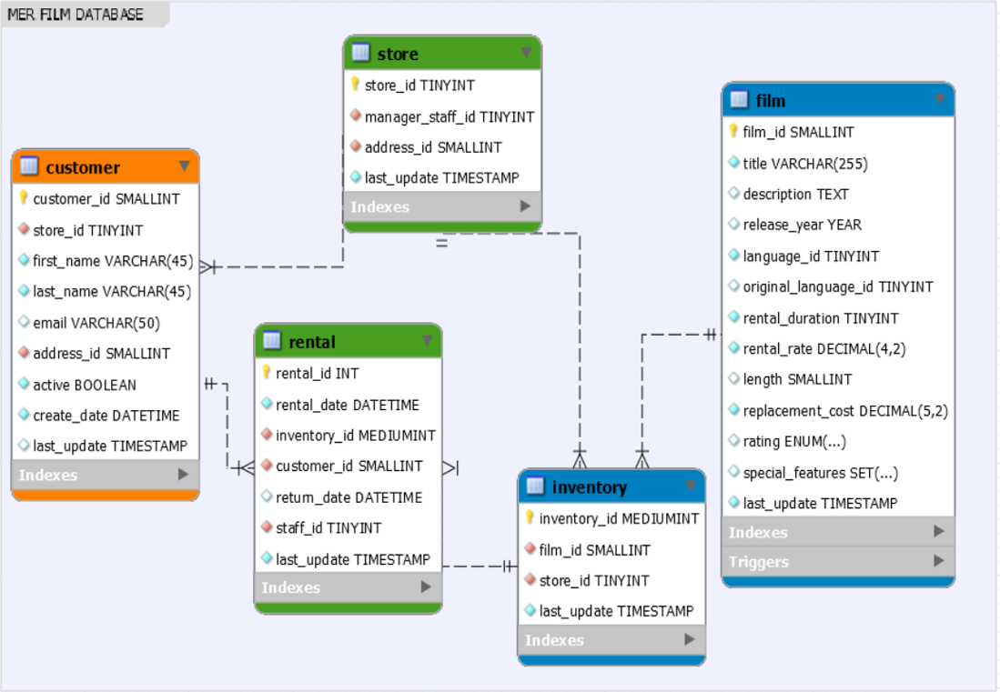

# ETL Films

Este es un proyecto ETL que extrae, transforma, limpia y carga datos de películas desde un archivo Excel a una base de datos MySQL.

## Requisitos

Asegúrate de tener instalado lo siguiente en tu máquina:

* [Python](https://www.python.org/downloads/) (versión 3.6 o superior)
* [Pip](https://pip.pypa.io/en/stable/installation/)
* [Git](https://git-scm.com/downloads)
* [MySQL](https://www.mysql.com/downloads/)

## Configuración del entorno local

1.  **Clona el repositorio:**

    ```
    git clone https://github.com/JuanCamiloBlandon/ETL_FILMS.git
    ```

2.  **Navega a la carpeta del proyecto:**

    ```
    cd ETL_FILMS
    ```

3.  **Crea un entorno virtual:**

    * Instala `virtualenv` (si no lo tienes):

        ```
        pip install virtualenv
        ```

    * Crea el entorno virtual:

        ```
        virtualenv venv
        ```

    * Activa el entorno virtual:
        * **Windows:**

            ```
            .\venv\Scripts\activate
            ```

        * **macOS/Linux:**

            ```
            source venv/bin/activate
            ```

4.  **Instala las dependencias:**

    ```
    pip install -r requirements.txt
    ```

5.  **Verifica la instalación de MySQL:**

    ```
    mysql --version
    ```

    * Asegúrate de tener MySQL instalado y un cliente como MySQL Workbench para ejecutar consultas.

6.  **Crea la base de datos:**

    * Abre el archivo `Script film database.sql` (en la carpeta `Script BD`) en tu cliente de MySQL.
    * Ejecuta el script para crear la base de datos y las tablas.
    * Verifica que las tablas se hayan creado correctamente.

7.  **Configura la conexión a la base de datos:**

    * Abre el archivo `configuracion_bd.py` (en la carpeta `etl_films`).
    * Modifica la cadena de conexión a MySQL con tu host, usuario y contraseña.
    * Verifica que la conexión a la base de datos sea exitosa.

## Ejecución del proyecto

1.  **Ejecuta el archivo `main.py`:**

    ```
    python main.py
    ```

2.  **Verifica la ejecución:**

    * Revisa la salida en la consola.
    * Consulta el archivo `etl_films.log` en la carpeta `Logs`.

## Diagrama ER

